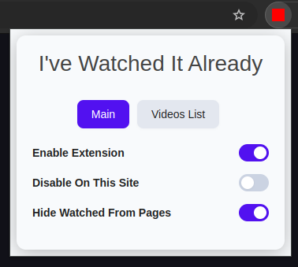
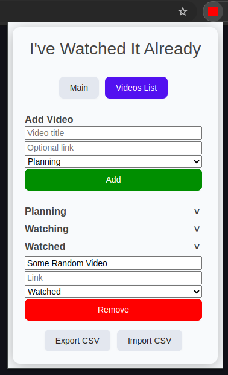

# IWIA - I've Watched It Already

<!--  -->

**I've Watched It Already (IWIA)** is a modern, privacy-friendly Chrome extension that helps you keep track of videos you've already watched and hide them from web pages. Never waste time rewatching the same content!

---

## 📚 Table of Contents

- [✨ Features](#-features)
- [🛠️ Coming Soon](#%EF%B8%8F-coming-soon)
- [🚀 Getting Started](#-getting-started)
- [🖼️ Screenshots](#%EF%B8%8F-screenshots)
- [⚙️ Options](#%EF%B8%8F-options)
- [🛡️ Privacy](#%EF%B8%8F-privacy)
- [⚠️ Known Limitations](#%EF%B8%8F-known-limitations)
- [🤝 Contributing](#-contributing)
    - [🐞 Bug Report Template](#-bug-report-template)
- [📝 License](#-license)
- [📫 Contact](#-contact)

---

## ✨ Features

- **Hide Watched Videos:** Automatically hides videos you've marked as "watched" using a simple algorithm.
- **Personal Video List:** Add, edit, and organise your watched, watching, and planning-to-watch videos.
- **CSV Import/Export:** Easily back up or transfer your video list.
- **Site Controls:** Enable/disable the extension per site or globally.
- **Modern UI:** Clean, responsive popup with friendly design.
- **Privacy First:** All data is stored locally in your browser.

---

## 🛠️ Coming Soon

- **Video Detection (Optional):** Automatically detect and add videos to list.
- **Improved Site Support:** Add targeted support for different video platforms for smarter video detection and hiding mechanisms.
- **Cloud Sync (Optional):** Sync your list across devices (privacy-respecting).
- **Custom Tags & Notes:** Add personal notes or tags to videos.
- **Dark Mode:** I prefer dark mode as well!

---

## 🚀 Getting Started

1. **Install the Extension**

    - **Local Installation**
        1. [Download the latest release ZIP](https://github.com/jose-dls/iwia/releases) **or** [clone this repository](https://github.com/jose-dls/iwia).
        2. Open Chrome and go to `chrome://extensions/`.
        3. Enable **Developer mode** (toggle in the top right).
        4. Click **Load unpacked** and select the project [extension](extension) folder (the one containing `manifest.json`).
        5. The extension should now appear in your extensions list.

    - **Chrome Web Store**
        - *Coming Soon...*  
          (Once published, you’ll be able to install directly from the Chrome Web Store.)

2. **Usage**
   - Click the IWIA icon in your browser toolbar.
   - Use the toggles to enable/disable the extension or hide watched videos.
   - Add videos manually or let the extension track them for you.
   - Switch between the "Main" and "Videos List" tabs to manage your list.

---

## 🖼️ Screenshots

| Main Tab | Videos List |
|----------|-------------|
|  |  |

---

## ⚙️ Options

- **Enable Extension:** Master switch for all features.
- **Disable On This Site:** Temporarily turn off hiding for the current site.
- **Hide Watched From Pages:** Toggle hiding of watched videos.

---

## 🛡️ Privacy

IWIA does **not** collect or transmit any personal data. All your video lists and settings are stored locally in your browser.

---

## ⚠️ Known Limitations

Due to the nature of the current hiding algorithm (a simple nested search and text comparison in [`extension/content.js`](extension/content.js)), there may be occasional false positives. For example, non-video elements with similar or matching text to your watched video titles might be hidden unintentionally. This approach is designed for broad compatibility and performance, but it is not perfect and may not work optimally on all sites.

If you encounter any issues or unexpected behavior, please report them! Your feedback helps improve the extension.

---

## 🤝 Contributing

Pull requests and suggestions are welcome!  
Feel free to open an issue or submit a PR.

---

### 🐞 Bug Report Template

When reporting an issue, please include as much detail as possible:

- **Describe the bug:**  
  A clear and concise description of what the bug is.

- **Steps to reproduce:**  
  1. Go to '...'
  2. Click on '...'
  3. See error

- **Expected behavior:**  
  A clear and concise description of what you expected to happen.

- **Screenshots:**  
  If applicable, add screenshots to help explain your problem.

- **Environment:**  
  - Browser (e.g., Chrome 123.0.0)
  - Extension version (see `chrome://extensions/`)

- **Additional context:**  
  Add any other context about the problem here.

You can open an issue on [GitHub](https://github.com/jose-dls/iwia/issues).

---

## 📝 License

[MIT License](LICENSE)  
Copyright (c) 2025 J. De Los Santos

---

## 📫 Contact

For questions or feedback, open an issue on [GitHub](https://github.com/jose-dls/iwia/issues).

---
